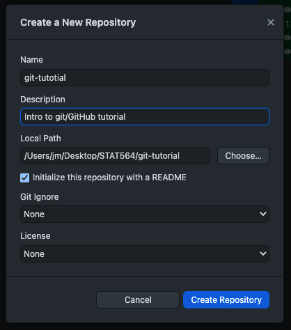
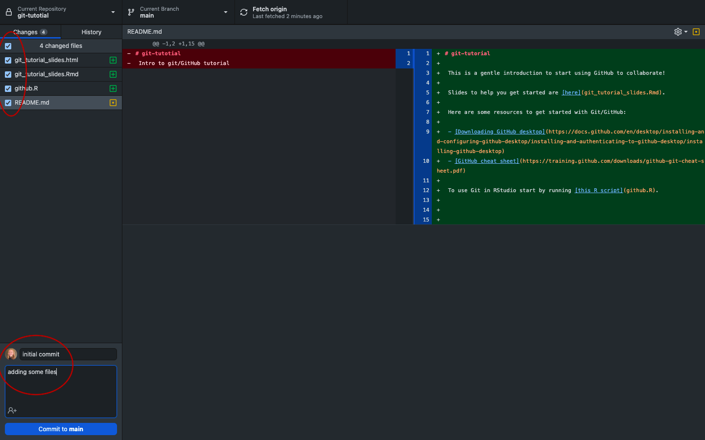
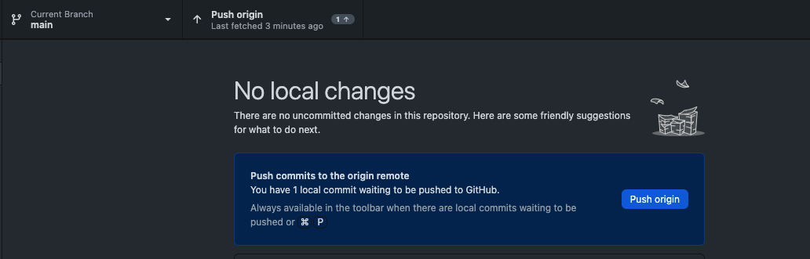

## What is Git?

-   Git is a version control system designed to make it easier to have
    multiple versions of a code base, potentially across multiple
    teams/developers.
-   It allows you to see changes you make to your code and easily revert
    them.
-   This is not GitHub!

## What is GitHub?

-   github.com is a website that hosts git repositories on a remote
    server.
-   Hosting repositories on GitHub facilitates the sharing of codebases
    among teams by providing an interface to easily fork or clone repos
    to a local machine.
-   By pushing your repos to github, you will pretty much automatically
    create your own portfolio as well (if you make your repos public).
-   Easy collaboration

## What we will cover

-   How to set up your own repositories.
-   How to keep them updates locally and remotely.
-   The *basics* of Git version control system (command line).
-   Using GitHub as our repository hosting service (via GitHub Desktop).
-   Workflows for your project and how to collaborate with other.

# Git

## Using Git

We first need to specify the following so Git knows who is making
changes.

    git config --global user.name 'your_username'
    git config --global user.email 'your_email'

Set default branch name called main:

    git config --global init.defult branch main

Need to know where files are stored. Change your directory to where the
files are. To turn that directory into a git repository:

    git init

Status of the repository:

    git status

Add tracking to a file:

    git add github.R

Track all flies (these are in staging):

    git add .

Commit files:

    git commit -m "message about what we did - committing all files"

# GitHub

## What is GitHub Desktop?

-   A graphical user interface (GUI) to manage your Git repos on your
    computer with out having to use the command line.
-   You can also use Rstudio to do this!

## GitHub Desktop

It’s easy to add and remove repos.

Staging and committing is simplified.

1.  Click the checkbox of all files you want to stage
2.  Add your commit message and press commit.

Click push to push changes to the remote

## Basic workflow

First time:

1.  Create a *repo* (or clone one that you want to work from locally).
2.  Work on the files.
3.  *Commit* your changes (be sure to include an informative message
    about your changes eg. “added a plot”.
4.  *Push* your changes to the remote repo.

## Basic workflow

Subsequent times:

-   *Pull* any changes from the remote repo that your collaborators may
    have made.
-   repeat above steps.

## Tips to keep things tidy

The “culture” of making edits:

-   Do not commit every time anything is new.
-   Each commit should be a nice neat little story:
    -   eg. If you include a new function and update README, the stage
        both and commit it together.
-   Should be able to look back and understand what you were
    thinking/doing. Your future self will thank you!

## Project workflow and collaboration

Best practice workflow for collaborating with others (your future self
included!)

1.  Raise issue
2.  Create a branch to address issue
3.  Add commits
4.  Pull request
5.  Review changes and get feedback
6.  Merge changes

## Raising an issue

-   Can be done by you, collaborators, or if the repo is public, anyone!
    Used to reveal a bug, add and idea or feature, or spot a typo.

## Branching

-   If you are making modifications to a repo that is actively being
    used, you may want to maintain a working version until your updates
    are finished. eg. adding a new feature, fixing a bug.

-   Creating a branch creates a copy of your repo so that the commit
    history can diverge from the main branch. The main or master branch
    is the end product (what is published).

## Pull requests

-   This is GitHub’s way of (eventually) merging branches. Pull requests
    are the key to collaboration!

-   When you start a new pull request, you first specify which branches
    you want to bring together.

-   Next, add a comment to describe what this merge is doing. At this
    point you can add reviewers (someone who you are collaborating with
    who you want to review the changes before the merge happens).

-   Once the pull request is added other people can look at the request
    and add comments and feedback. If this addresses an issue the issue
    number can be attached to the pull request. GitHub will check if
    there are any conflicts between branches and allow the branches to
    merge successfully.

-   You can then merge the pull request and delete the old branch.

## Other usefull stuff

-   **Forking** copies a repo so you can make changes to it without any
    risk to the original ie. creates a personal copy of something owned
    by someone else.

-   **What is the .gitignore file?** Contains a list of files or
    directories that you want Git to ignore. eg. if you have personal
    files that you do not want to upload to GitHub.

## GitHub in RStudio

-   Use the github.R script to get started

## Resources

GitHub has lots of tutorials!

Official manual:
<https://githubtraining.github.io/training-manual/book.pdf>

Git cheat-sheet:
<https://training.github.com/downloads/github-git-cheat-sheet.pdf>

Reverting commits:
<https://help.github.com/desktop/guides/contributing/reverting-a-commit/>

Using GitHub to host a website:
<https://docs.github.com/en/pages/getting-started-with-github-pages/creating-a-github-pages-site>
